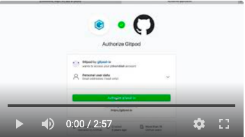

# Hello ImGui Demo app

This repository demonstrates how to create a new multiplatform application using [Hello, Dear ImGui](https://github.com/pthom/hello_imgui). 

This application will work on iOS, Android, Linux, MacOS, Windows, and emscripten.

# Instant develop

A preconfigured workspace is available at gitpod.io 
You can develop small ImGui applications in 3 minutes, *without even installing anything*!: 

[Open the workspace](https://gitpod.io/#github.com/pthom/hello_imgui_my_app/tree/gitpod)

See the demo on youtube below for some explanations:

[](https://youtu.be/mZXXvptWlaA)

# ImGui Manual

Access the interactive ImGui Manual here: [ImGui Manual](https://traineq.org/imgui_manual/src/imgui_manual.html)


# Info and build instructions on your own computer

## hello_imgui submodule

hello_imgui is a submodule: 
````bash
git submodule add https://github.com/pthom/hello_imgui.git external/hello_imgui
````

## Embedded assets

Files in the assets/ folder are embedded automatically on iOS, Android and emscripten.

## Custom settings for iOS and Android:

This application has some custom settings for iOS and Android (icon, icon name, etc.)

### iOS
````
ios
├── Info.plist
└── icons/
    ├── Default-375w-812h@3x.disabled.png
    ├── Default-568h@2x.png
    ├── Default.png
    ├── Icon.png
    └── Readme.md
````

### Android
````
android
├── mipmap-source/
│   ├── Readme.md
│   └── ic_launcher.png
└── res/
    ├── mipmap-hdpi/
    │   └── ic_launcher.png
    ├── mipmap-mdpi/
    │   └── ic_launcher.png
    ├── mipmap-xhdpi/
    │   └── ic_launcher.png
    ├── mipmap-xxhdpi/
    │   └── ic_launcher.png
    ├── mipmap-xxxhdpi/
    │   └── ic_launcher.png
    └── values/
        ├── colors.xml
        ├── strings.xml
        └── styles.xml
````

# Compile for desktop

See [compile_sdl_desktop.sh](compile_sdl_desktop.sh)

````bash
# Step 1: update submodule recursively
git submodule update --init --recursive

# Step 2: install third paties via vcpkg
python ./external/hello_imgui/tools/vcpkg_install_third_parties.py

# Step 3: run cmake using vcpkg toolchain
mkdir build_sdl 
cd build_sdl
cmake .. -DCMAKE_TOOLCHAIN_FILE=../external/hello_imgui/vcpkg/scripts/buildsystems/vcpkg.cmake -DHELLOIMGUI_USE_SDL_OPENGL3=ON

# Step 4: build
make -j 4

# Step 5: run the app
./hello
````

# Compile for emscripten

````bash
# Step 1: install emscripten
./external/hello_imgui/tools/emscripten/install_emscripten.sh

# Step 2: add emscripten to your PATH
source ~/emsdk/emsdk_env.sh

# Step 3: run cmake using vcpkg toolchain
mkdir build_emscripten && cd build_emscripten
emcmake cmake .. 

# Step 4: build
make -j 4

# Step 5: run a web server
python3 -m http.server

# Step 6: Open a browser and open the url
# http://localhost:8000/hello.html
````


# Compile for iOS

````bash
# Step 1: build sdl
./external/hello_imgui/tools/ios/sdl_compile_ios.sh

# Step 2: set your Apple Development Team Id
export CMAKE_XCODE_ATTRIBUTE_DEVELOPMENT_TEAM=0123456789

# Step : cmake
mkdir build_ios
cd build_ios
cmake .. \
  -GXcode \
  -DCMAKE_TOOLCHAIN_FILE=../external/hello_imgui/hello_imgui_cmake/ios-cmake/ios.toolchain.cmake \
  -DHELLOIMGUI_USE_SDL_OPENGL3=ON \
  -DPLATFORM=OS64 \
  -DENABLE_BITCODE=OFF \
  .. 

# Step : open Xcode, build and run
open my_app.xcodeproj

````

# Compile for Android

````bash
# Step 1: download SDL
./external/hello_imgui/tools/sdl_download.sh

# Step 2: Set android sdk and ndk paths
export ANDROID_HOME=/Users/me/Library/Android/sdk
export ANDROID_NDK_HOME=$ANDROID_HOME/ndk-bundle
export android_toolchain_file=$ANDROID_NDK_HOME/build/cmake/android.toolchain.cmake

# Step 3 : Set JAVA_HOME to a path with jdk 8
export JAVA_HOME=/Library/Java/JavaVirtualMachines/adoptopenjdk-8.jdk/Contents/Home

# Step 4: select your abi
export android_abi=armeabi-v7a

# Step 5: run cmake with option -DHELLOIMGUI_CREATE_ANDROID_STUDIO_PROJECT=ON
cmake \
    -DCMAKE_TOOLCHAIN_FILE=$android_toolchain_file \
    -DANDROID_ABI=$android_abi \
    -DHELLOIMGUI_USE_SDL_OPENGL3=ON \
    -DHELLOIMGUI_CREATE_ANDROID_STUDIO_PROJECT=ON \
    ..

# Step 6: open the project hello_AndroidStudio/ with Android Studio
# And build / debug the app!
# Alternatively, via the command line: 
cd hello_AndroidStudio
./gradlew build
./gradlew installDebug
```
